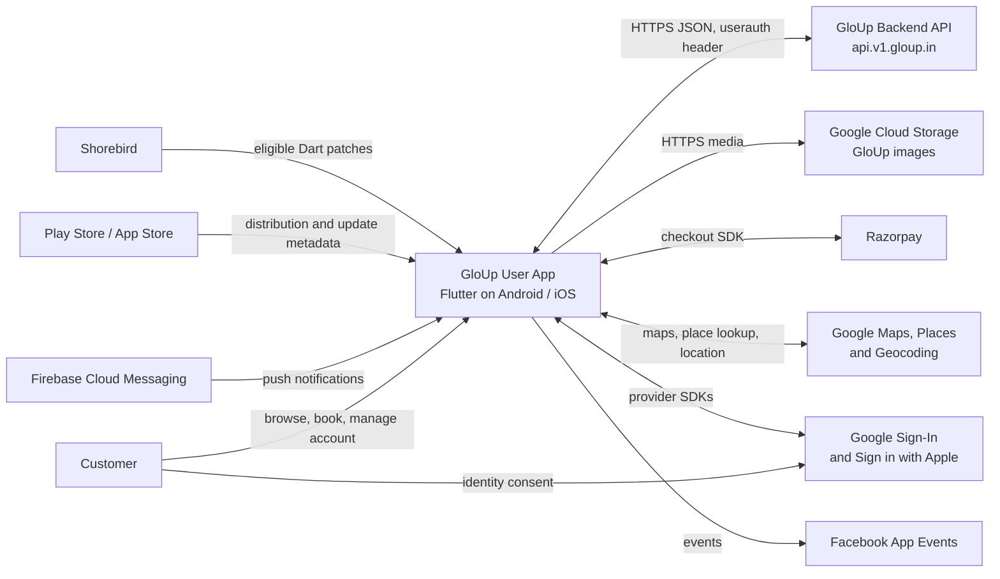
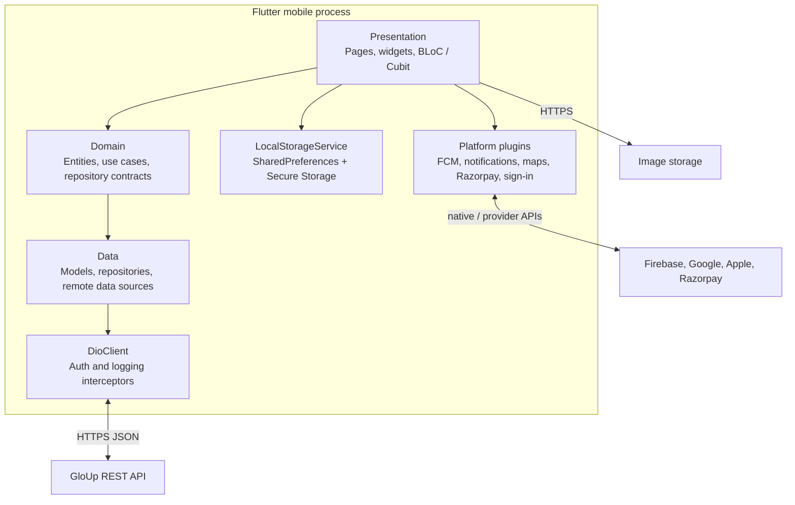
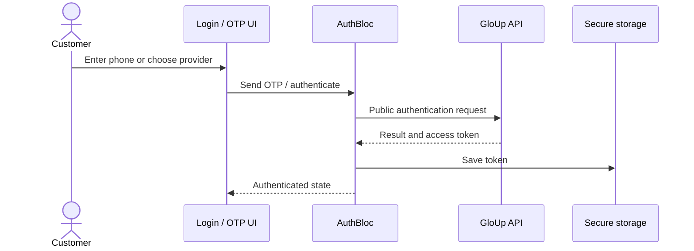
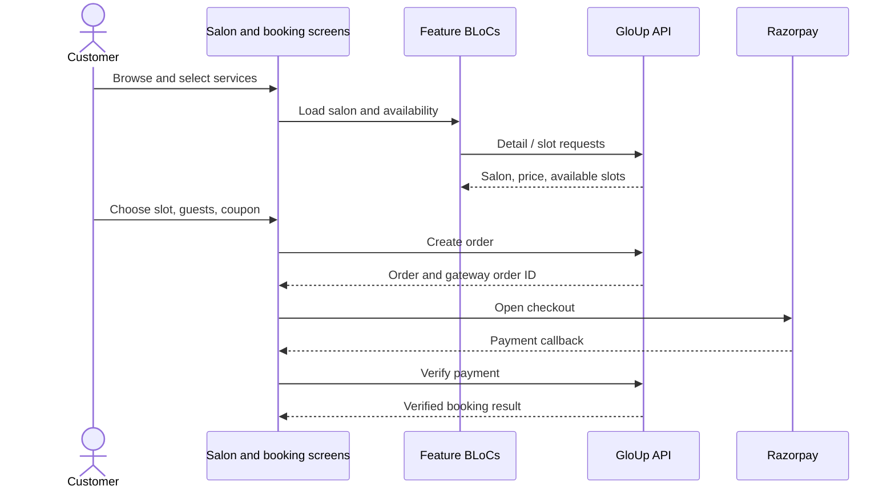

# GloUp Customer Mobile App: Architecture and Application Control Overview

> Document owner: Mobile Engineering · Review date: 2026-09-28 · Source version declared: Android `2.8.14+73` · Classification: Internal audit support

## 1. Purpose and scope

GloUp User (Flutter package name `tressy`) is the customer-facing mobile app for discovering salons and services, reviewing prices and availability, booking appointments, paying, and managing bookings and profile information. This document describes the implementation represented by this repository and is intended for developers, backend engineers, QA, release engineering, and product stakeholders.

The app is a client in the wider GloUp platform. Partner and administrative applications, backend implementation, and authoritative API schemas are outside this repository. The client handles presentation, local UX state, client-side validation and bill display, and integration orchestration. The backend is authoritative for user data, availability, order creation, payment verification, appointment status, and refund outcomes.

Android and iOS are the intended mobile platforms. Web and desktop scaffolding exists but does not establish supported distribution. API calls default to `https://api.v1.gloup.in`; the URL can be overridden at build/run time with `--dart-define=API_BASE_URL=...`.

### Audit summary

The client is a Flutter app organized by feature, with remote business operations delegated to the GloUp API and payment status verified through a server endpoint. The source includes secure storage for the access token, explicit session expiry handling, and debug-only Dio request logging with field-name redaction.

Several repository settings require audit evidence before production conclusions: Android permits cleartext traffic; the checked-in iOS APNs entitlement is set to development; native permission declarations are broader than some visible feature use; and location/diagnostic logging and payment-field redaction need review. The Android release build can fall back to debug signing, while CI does not produce a production-signed artifact. Backend authorization, deletion/retention, provider key restrictions, and deployed binary configuration are outside this repository.

## 2. System context



| External system | Role in the app |
|---|---|
| GloUp Backend API | Authentication, discovery, salon data, availability, orders, payment verification, appointments, profile, coupons, favorites, and reviews |
| Google Cloud Storage | Image media referenced by backend data; base URL is `https://storage.googleapis.com/gloup-images` |
| Firebase | App initialization and push delivery through Firebase Cloud Messaging |
| Razorpay | Checkout UI; order creation and payment verification remain backend operations |
| Google Maps / Places / Geocoding | Map display, place lookup, device location, and address resolution |
| Google and Apple identity | Federated sign-in |
| Facebook App Events | App event analytics integration |
| Play Store / App Store | App distribution and update metadata; Android Immediate update is supported |
| Shorebird | Delivery of eligible Dart-only patches associated with a native release |

## 3. Runtime architecture

### 3.1 Container view



The Flutter client is one deployed application, not independently deployed services. Feature layers communicate in-process. Remote data sources use `DioClient`; plugin calls reach platform SDKs through Flutter plugins. Local state uses platform preferences and secure storage. There is no general local database or offline API cache evident in the current app.

### 3.2 Feature layer pattern

Where fully implemented, a feature follows:

```text
Page / Widget -> BLoC or Cubit -> Use case -> Repository contract
              -> Repository implementation -> Data source -> Dio / platform API
```

The presentation layer owns screens and state transitions. Domain code owns entities, use cases, and repository interfaces. Data code owns API-shaped models, mapping, and data source implementations. Models are mapped into domain entities at the data boundary. Some features are thinner or reuse `shared/` contracts; apply the pattern where it clarifies ownership rather than adding pass-through classes.

### 3.3 State management and dependency injection

`flutter_bloc` is the main feature-state tool. Provider is used for app-wide theme and location state (`ThemeProvider` and `LocationProvider`). `get_it` registration is centralized in [`injection_container.dart`](../lib/core/di/injection_container.dart). Shared/stateless services, repositories, and use cases are generally lazy singletons. Screen-scoped BLoCs are generally factories. A few BLoCs (home, category, favorites, appointments) are shared intentionally across screens.

[`main.dart`](../lib/main.dart) initializes Flutter bindings, local storage, Firebase, local notifications, dependencies, presence heartbeat, and notification handling before `runApp`. Initialization order matters: notification service accesses the registered `DioClient`. Root-level BLoCs and Providers are provided by `MyApp`.

### 3.4 Code boundaries

| Directory | Responsibility |
|---|---|
| `lib/core/` | App-wide network, routing, DI, constants, providers, services, theme, and utilities |
| `lib/shared/` | Reusable salon data/domain contracts and cross-feature widgets |
| `lib/features/<feature>/` | Capability-specific presentation, domain, data, and state |
| `lib/features/widgets/` | Common UI primitives without feature-domain ownership |

## 4. Feature catalog

| Feature | Responsibility | Main state / integration |
|---|---|---|
| `splash` | Startup screen and transition | Root route; update checks are app-level |
| `onboarding` | First-use introduction | Onboarding preference |
| `auth` | OTP, Google/Apple sign-in, logout, token handling | `AuthBloc`, secure token storage |
| `location` | Location permission and address selection | `LocationProvider`, geolocation/place packages |
| `home` | Banners, categories, salon discovery, pending-review prompt | Shared `HomeBloc`, category and salon data |
| `category` | Category and category-based discovery | Shared `CategoryBloc` |
| `explore` | Explore listings | `ExploreBloc`, shared salon use case |
| `salon_search` / `map_markers` | Search, map view, nearby results and markers | Search/marker BLoCs, Google Maps |
| `salon_details` | Salon information, services, prices, gallery and reviews | Detail BLoC and page Cubit |
| `slot_booking` | Date, slot availability and holidays | `SlotBloc` |
| `booking_confirmation` | Guests, coupons, billing, order creation and checkout | `GuestBloc`, `OrderBloc`, price calculator, Razorpay |
| `bookings` | Appointment list and cancellation/review entry points | `AppointmentsBloc` |
| `coupons` | Active coupon discovery | `CouponBloc` |
| `favorites` | Favorite salon list and toggle | Shared `FavoritesBloc` |
| `my_reviews` | Customer review screens | Review APIs and router |
| `profile` | Profile, wallet, settings, support and legal content | `ProfileBloc`, profile repository |

The table describes source capabilities; reachability can vary by release configuration and user state. The primary ownership group is Mobile Engineering.

## 5. Navigation and external links

Routing uses `go_router` in [`app_router.dart`](../lib/core/router/app_router.dart); path constants are in [`route_names.dart`](../lib/core/router/route_names.dart). Main paths include splash (`/`), onboarding, login, OTP, home, explore, favorites, bookings, category, salon search, salon details, nested slot booking and review confirmation, profile, reviews, wallet, settings, invite, and support/legal screens. Several nested routes and screens pass data through `state.extra`; callers and route builders must keep those keys and types aligned.

The global router redirect callback currently returns `null`, so it does not enforce a global auth guard. Separately, an authenticated API 401 clears session data and navigates to login through `AuthSessionManager`. Backend authorization remains authoritative.

[`NotificationRoutes`](../lib/core/router/notification_routes.dart) translates notification type or route aliases into router destinations. Booking types open bookings; salon/store types require an ID; promotion types open home; category data is passed as route extras. Unknown notification types fall back to home; an empty payload is ignored.

`AppLinks().uriLinkStream` currently logs received URIs only. Native link hosts include `www.gloup.in` and `api.v1.gloup.in`, but the Dart listener does not map inbound links to app screens. Do not rely on a URL opening a specific in-app destination until routing is implemented and tested.

## 6. Networking and authentication

### 6.1 HTTP behavior

[`DioClient`](../lib/core/network/dio_client.dart) configures JSON responses, a JSON content type, and 60-second send and receive timeouts. It installs `AuthInterceptor` and `LoggerInterceptor`. API base URL is read from `API_BASE_URL` and defaults to production. Image URL helpers use the Google Cloud Storage base URL.

[`AuthInterceptor`](../lib/core/network/auth_interceptor.dart) attaches a stored token in the `userauth` header to non-public auth paths. OTP send/verify and Google/Apple login are public. For protected routes, a 401 (or recognized unauthorized error) stops the presence heartbeat, clears token and logged-in state, and calls the root navigation callback. Current policy classifies every non-public auth path as requiring auth on 401; coordinate any optional-auth behavior explicitly with the backend contract.

Dio transport and status errors are translated into `ApiException` subclasses. Repositories commonly expose `Either<Failure, T>` from `dartz`. Connectivity is surfaced through `NetworkInfo`, and `repository_network_guard.dart` provides an offline short-circuit. No global automatic retry policy is configured. Retrying transaction requests must be operation-specific to avoid duplicate orders.

### 6.2 Endpoint inventory

Paths below are relative to the configured base URL. This is a client path inventory, not a full schema or guaranteed HTTP method list; consult backend API documentation and the corresponding data source for payloads and verbs.

| Area | Paths declared in `ApiRoutes` |
|---|---|
| Authentication | `/user/auth/sendOTP`, `/user/auth/verifyOTP`, `/user/auth/deviceId`, `/user/auth/googlelogin`, `/user/auth/appleLogin`, `/user/auth/logout` |
| Presence | `/user/app/v2/heartbeat` |
| Discovery | `/user/app/v2/getbanner`, `/user/app/v2/getallcategory`, `/user/app/v2/store/nearby`, `/user/app/v2/get-all-stores`, `/user/app/v2/salons/top`, `/user/app/v2/services/top-categories`, `/user/app/v2/stores/by-category` |
| Salon and map | `/user/app/v2/store/details`, `/user/app/v2/salons/map-markers-clustered` |
| Favorites | `/user/app/v2/favourites` |
| Slots and guests | `/user/app/v2/getslotstatus`, `/user/app/v2/store/holidays`, `/user/app/v2/guest/all`, `/user/app/v2/guest/add`, `/user/app/v2/guest/update` |
| Orders and appointments | `/user/app/v2/createorder`, `/user/app/v2/paymentsuccess`, `/user/app/v2/cancel-pending-order`, `/user/app/getallapointments` |
| Profile and coupons | `/user/app/v2/profile`, `/user/app/v2/get/activecoupons` |
| Reviews | `/user/app/addreview`, `/user/app/v2/pending-reviews`, `/user/app/v2/reviews` |

Google Places nearby search, autocomplete, and details endpoints are declared separately from the GloUp API. Avoid putting provider credentials or secrets in this document.

## 7. Important user flows

### 7.1 Sign-in and session restore



At startup, storage migrates a legacy preference token if present and warms the secure token cache. The backend determines session validity. Protected 401 responses clear local credentials and return the user to login.

### 7.2 Discovery, booking, and payment



Availability errors should allow refresh or reselection. If payment fails or is dismissed, the app has failure handling and can cancel a pending order. Do not blindly repeat order creation. Present a successful booking only after backend payment verification; gateway callbacks alone are not authoritative. Backend idempotency behavior must be confirmed with the server contract.

### 7.3 Price calculation

[`BookingPriceCalculator`](../lib/features/booking_confirmation/domain/utils/booking_price_calculator.dart) normalizes service price maps that may contain numeric or string amounts and alternate field names. Payable price is taken from `price`, `amount`, discounted amount aliases, or `sellingPrice`, with original price as a final fallback. List price checks `originalPrice`, `mrp`, then `amount`. Display a strikethrough only when list price exceeds payable price.

The calculator sums list and payable totals, clamps coupon discount to the subtotal, applies the default 5% GST rate to the discounted taxable amount, adds the supplied platform fee, subtracts wallet amount, and clamps final payable to zero. The client calculation is for the displayed breakdown; the server remains authoritative. Confirm fee, tax, rounding, coupon, and wallet policy with backend/product before changing it.

### 7.4 Cancellation, reviews, and notification taps

Cancellation and refund status are server/payment-provider controlled. Pending-review prompts are fetched from the backend; dismissal is persisted per appointment ID on the device. FCM tap payloads are resolved by `NotificationRoutes` and navigated using `go_router`. Payload field names and API schemas are backend contracts and should be coordinated when changed.

## 8. Integrations and local state

| Integration / storage | Implementation | Notes |
|---|---|---|
| Firebase | `firebase_core`, `firebase_messaging`, `firebase_options.dart` | Initialization and FCM delivery; validate platform config and permissions |
| Local notifications | `flutter_local_notifications` | Android foreground/data-only notifications; channel `gloup_default_channel` |
| Razorpay | `razorpay_flutter` | Checkout after server order creation; payment verification uses backend |
| Maps and location | `google_maps_flutter`, Places package, `geolocator`, `geocoding` | Requires platform API configuration and location permissions |
| Social sign-in | `google_sign_in`, `sign_in_with_apple` | Provider console setup and native capabilities required |
| Analytics | `facebook_app_events` | Verify app ID/configuration and event policy |
| Update checks | `upgrader`, `in_app_update` | Android Play Immediate flow plus cross-platform alert behavior |
| App Links | `app_links` | URI listener currently logs only |
| Shorebird | `shorebird.yaml` and project scripts | Auto updates enabled by default; native/plugin changes need store build |
| Access token | `FlutterSecureStorage` | Secure platform storage; in-memory cache after startup |
| UX preferences | `SharedPreferences` | Onboarding, logged-in flag, location, theme, FCM token, generic preferences, dismissed review IDs |
| Images | `cached_network_image` and app wrappers | Rendering cache; not an offline API/data guarantee |

`LocalStorageService.clearAll()` clears preferences and the secure token. Session expiry clears tokens and logged-in state. Review state, location, and onboarding behavior around explicit logout should remain intentional when storage keys change. Provider configuration files and client SDK identifiers should be reviewed against their platform/provider handling policies; never put signing credentials or server secrets in source control.

Notification behavior: background/terminated messages with notification payloads are displayed by the OS; foreground iOS uses system presentation, foreground Android creates a local notification, and data-only notifications are built locally when title/body fields are available. Notification images are downloaded with a five-second timeout and fall back to text if unavailable. Payload data is JSON encoded for tap routing.

## 9. Quality attributes and platform constraints

### Security

- Use HTTPS for backend calls and keep access tokens in secure storage.
- Do not log tokens, payment secrets, or sensitive personal data.
- Keep signing credentials outside source control; restrict provider keys in their consoles.
- Android release enables minification and resource shrinking with ProGuard rules.

### Resilience and performance

- HTTP send/receive timeout is 60 seconds; no general offline database or API cache is present.
- Connectivity guards exist, but each flow needs explicit loading, empty, and error behavior.
- Image caching and image dimension helpers support efficient rendering.
- Repository does not define measurable cold-start, home-load, or image-size budgets; these require product/engineering targets before claiming performance compliance.

### Supported platforms and accessibility

iOS deployment target is 15.0 in `ios/Podfile`. Android uses Flutter's configured minimum SDK and currently targets SDK 36. Confirm resolved minimum SDK and store requirements during release. Accessibility and localization policies are not specified; new screens should support scalable text, semantics, contrast, and screen-reader operation.

## 10. Build, release, and deployment

### CI

`.github/workflows/ci.yml` runs on pushes and pull requests to `main` and `develop`. It installs Flutter stable, checks formatting, runs `flutter analyze --no-fatal-infos` and `flutter test`, then builds a debug Android APK and an iOS release build without codesigning. CI compilation does not validate store signing or release delivery.

### Version, environment, signing

`pubspec.yaml` declares Android `2.8.14+73`; a commented iOS example says `2.9.11+72`. Confirm actual iOS version from release configuration and store metadata. Android `versionCode` must increase between Play releases. Build API environment using `--dart-define=API_BASE_URL=...`; the default is production.

Android reads signing data from `android/key.properties` or `KEY_ALIAS`, `KEY_PASSWORD`, `KEYSTORE_PATH`, and `STORE_PASSWORD`. Release config falls back to debug signing when credentials are absent; this must not be used for store publication. Android release enables minification and resource shrinking. iOS release requires normal Xcode signing, provisioning, and entitlements.

### Shorebird and dependency constraints

Use Shorebird patches only for eligible Dart-only changes associated with a native release; plugin and native changes need a new store build. Keep patch and store versions traceable. `pubspec.yaml` overrides `google_maps_flutter_android` at `^2.19.12` and pins `package_info_plus` to `10.1.0`; comments describe map lifecycle and Android release/Shorebird build compatibility reasons. Revalidate those constraints before changing them.

### Release checks

Confirm version/build numbers and API environment; validate signing identity and provider configuration; smoke-test OTP, discovery, salon details, slots, booking, payment success/failure, cancellation, and notification taps on physical Android/iOS devices; verify logs and crash reporting; create signed artifacts; stage rollout; record the associated Shorebird release/patch. Operational credentials and approvals are maintained outside this repository.

## 11. Testing strategy

Tests exist for auth pages and BLoC, booking order state and price calculation, profile state, home, cancellation dialog and policy, notification routing/service, API auth routes, connectivity, and access-token migration. Test helpers and fixtures live under `test/helpers/`. `bloc_test` and `mocktail` are available.

For feature changes, cover domain boundary values, BLoC success/loading/failure behavior, repository mapping and error propagation, route and notification payload contracts, and critical transaction behavior. Before a release, smoke-test OTP, discovery, salon details, slot selection, checkout and backend verification, booking status, cancellation, and push taps on physical Android and iOS devices. Provider/backend integration tests are not replaced by repository unit tests.

## 12. Audit scope and evidence basis

This document describes the mobile client as represented by checked-in source and configuration. Evidence reviewed includes Flutter/Dart source, Android and iOS project configuration, dependency declarations, CI workflow, release automation, and repository tests.

This is an architecture and control overview for audit review. It is not a certification, penetration test, privacy assessment, or confirmation of production deployment settings. It does not establish backend controls, production signed-binary contents, provider-console restrictions, CI secret values, operational retention, or legal basis/consent. Those require evidence from the responsible service and release owners.

## 13. Data inventory and processing

The table identifies information handled by the client based on visible source paths. Backend storage duration, access controls, and deletion behavior are outside the client evidence reviewed here.

| Data category | Client use and processing | Local persistence observed | External destination / evidence |
|---|---|---|---|
| Phone number and OTP | Phone sign-in; OTP submission and verification | No durable persistence found in auth flow | GloUp API auth endpoints; `auth_remote_datasource.dart` |
| Federated identity material | Google ID token; Apple authorization code, identity token, user identifier sent for app login | No durable persistence found in client auth flow | GloUp API; `auth_remote_datasource.dart`, `social_auth_service.dart` |
| Access token and login state | Access token attached as `userauth`; session expiry clears token and login flag | Token in `FlutterSecureStorage`; cached in process. Login flag in SharedPreferences | GloUp API; `local_storage_service.dart`, `auth_interceptor.dart` |
| Profile/contact data | Profile retrieval/update, profile image, customer name, phone, email | Profile data is used in app state; no general profile cache identified | GloUp API; order payload includes name, phone, email in `order_model.dart` |
| Location and search input | GPS coordinates, city/area, place search text, selected place ID and address resolution | Coordinates, city, area in SharedPreferences | Google Places/Geocoding and salon discovery API; `location_page.dart`, `location_provider.dart`, salon search data sources |
| Booking and guest data | Store/service IDs, slot/date, guest and professional IDs, customer details, coupon, wallet amount, order/payment identifiers | Booking data held during workflow; no durable local booking database identified | GloUp API and Razorpay checkout; booking/order data sources |
| Reviews and appointment state | Appointment IDs, ratings, review text, salon references | Dismissed pending-review appointment IDs in SharedPreferences | GloUp API; `review_service.dart`, `local_storage_service.dart` |
| Push registration | FCM device token registered after login and on token refresh | FCM token in SharedPreferences | Firebase and GloUp device-ID endpoint; `firebase_notification_service.dart` |
| Notification content | Title/body and arbitrary data payload used for local presentation and navigation | Notification payload may be handed to local notification plugin; no long-term app database identified | FCM and OS notification surface; `firebase_notification_service.dart` |
| Diagnostics | API URLs, status/timing, request/response payloads in debug Dio logger; Places request URLs and location-provider messages also logged | Platform diagnostic log only; collection/retention outside app code | Device/developer logging facilities; `interceptor.dart`, `app_logger.dart`, `location_page.dart`, `location_provider.dart` |

### Local retention and account actions

- The token is migrated from a legacy SharedPreferences key to secure storage during initialization. The legacy value is removed after migration.
- SharedPreferences stores onboarding completion, login flag, theme/location preferences, FCM token, generic feature state, and dismissed review IDs.
- Logout calls the backend and clears local storage after a successful response. If the logout request fails, the current BLoC emits a failure and does not clear all local credentials; confirm expected offline logout behavior.
- Account deletion calls the profile DELETE endpoint. On a successful response, the client stops presence reporting and clears local state. The repository does not prove server-side deletion scope, backups, retention periods, or deletion of third-party records.

## 14. Security and privacy controls observed

| Control area | Evidence in the app | Audit interpretation |
|---|---|---|
| Transport | Production API default and image/Places URLs use HTTPS. Android manifest also sets `usesCleartextTraffic=true`; API base URL accepts a build-time string without scheme validation. | HTTPS is the normal configuration, but cleartext is not prohibited by checked-in Android policy. Confirm merged release manifest and enforce HTTPS for production builds. |
| Authentication | Public OTP/social login paths; token in `userauth` on other routes; session expiry clears token and login flag | API authentication is client-integrated. Router has no global auth redirect; backend authorization is required for every protected operation. |
| Credential storage | Secure storage for access token, with process cache and legacy migration | Appropriate storage mechanism is present for the bearer token. Review platform backup/migration configuration and device compromise assumptions. |
| Diagnostics | Dio interceptor logs only in `kDebugMode` and masks a fixed list of sensitive map/header keys | Redaction is key-name based, not a general personal-data filter. The list does not include `razorpay_signature`, `razorpay_payment_id`, customer phone/email/name, or location fields. Places and location logging uses `AppLogger`/debug prints outside a consistent central redaction policy. Confirm whether debug logs can enter collected or shared diagnostics; minimize and redact payload logging. |
| Payment | Backend creates the order; Razorpay SDK opens checkout; payment identifiers/signature are posted to backend verification endpoint | The flow separates order creation and server verification. Validate signature verification, order binding, idempotency, and reconciliation on the backend. Do not treat the client callback as proof of payment. |
| Client SDK configuration | Maps, Places, Firebase, Meta SDK identifiers/client token, and Razorpay key ID are configured in app source/native resources | Client SDK values are extractable from an app binary. Verify provider restrictions, app/package/bundle binding, quotas, environment separation, monitoring, and rotation. No server secret should be embedded in the client. |
| App integrity and network trust | No certificate pinning, root/jailbreak detection, or runtime integrity check was identified in the reviewed app source | This is a repository observation, not proof that infrastructure-side controls are absent. Confirm whether these controls are required by the threat model. |
| Backend authority | Client calls API for account, booking, coupon, and payment operations | Authorization, validation, rate limits, payment verification, audit logs, and data retention need backend evidence; this document cannot attest to them. |

## 15. Platform permissions and native configuration

The following declarations are in checked-in native files. The installed permission set must be confirmed from the final merged Android manifest and signed iOS archive, because plugins and build configuration can alter effective entitlements.

### Android

The app manifest declares internet, fine/coarse location, notification, advertising ID, foreground service, phone number, phone state, receive boot completed, and notification policy access permissions. Runtime code requests location for nearby discovery and phone permission for optional SIM-based phone-number autofill. Notification permission is requested by Firebase Messaging setup.

The audit should map each declared permission to an active user feature and verify least privilege, Play Console declarations, and effective merged-manifest permissions. In particular, confirm why foreground service, boot receiver, notification policy access, and advertising ID are required by this customer app and whether they originate from app code or a plugin.

Android application configuration sets `android:usesCleartextTraffic="true"`. The app activity is exported for launcher/link intents; Razorpay checkout activity is not exported. App Link intent filters are configured for `www.gloup.in/open` and `api.v1.gloup.in/download` paths. Flutter automatic deep-link routing is disabled.

### iOS

The checked-in `Info.plist` declares camera, microphone, photo library, when-in-use location, always-and-when-in-use location, and local-network usage descriptions. The visible client code uses location for discovery and image picking for profile editing; no microphone capture or background-location workflow was identified in the reviewed Dart code. Confirm whether those permission descriptions and entitlements are needed by current features or transitive SDK behavior.

The checked-in `Runner.entitlements` sets `aps-environment` to `development`, enables Apple Sign-In, and declares the `api.v1.gloup.in` associated domain. Verify the entitlement embedded in the production-signed archive uses the intended APNs environment and domain list. App Transport Security exceptions were not identified in the reviewed `Info.plist`.

## 16. External services and client-side configuration

| Service | Client use | Evidence and audit follow-up |
|---|---|---|
| GloUp API | Auth, discovery, location-based search, bookings, profiles, reviews, coupons | `lib/core/constants/api_routes.dart`; obtain backend API/security/data-retention evidence separately |
| Google Maps / Places / Geocoding | Map tiles, coordinates, place autocomplete/details and reverse geocoding | Keys and requests are present in Android manifest, iOS AppDelegate, and location page. Confirm each key is restricted to the required APIs and app identity. |
| Firebase Cloud Messaging | Permission, explicit token retrieval/refresh, device registration, foreground/background/tap handling | `FirebaseMessagingAutoInitEnabled` is false in iOS plist; app explicitly requests permission and fetches/registers a token. Confirm production project/environment and token lifecycle on logout. Evidence: `firebase_options.dart`, native Firebase config and notification service. |
| Razorpay | Checkout UI; backend order creation and verification | Key ID in API constants, SDK call in booking confirmation; verify live/test environment control and backend webhook/reconciliation evidence |
| Google / Apple sign-in | Provider credentials passed to GloUp API | Auth remote data source and platform setup; confirm consent, token validation, client IDs and provider console configuration |
| Facebook / Meta SDK | Native app identifiers/client token and dependency are configured | No direct `FacebookAppEvents` invocation was found in Dart source search; verify whether the native SDK emits events automatically and whether this integration is intended |
| Play Store updates | Android Immediate update flow and external listing fallback | Force-update service; verify behavior for non-Play and staged builds |
| Shorebird | Android release/patch automation and project configuration | `shorebird.yaml`, Fastlane and scripts; verify patch authorization, release inventory, approval and rollback records |

Client API keys and SDK identifiers are not server credentials, but they are public in distributed builds. This document intentionally omits their values. Provider restrictions and billing/abuse alerts should be evidenced outside the repository.

## 17. Build, release, and change control

- The app has no product flavor declarations identified in the reviewed Gradle configuration. API environment is selected with `API_BASE_URL`; Fastlane uses a production API default unless `SHOREBIRD_DART_DEFINES` is supplied. `scripts/local_testing.sh` supports local API overrides.
- `pubspec.yaml` declares Android version `2.8.14+73`; a separate iOS version line is only a comment. Confirm version/build numbers against store metadata and signed artifacts.
- Android release signing reads `android/key.properties` or environment variables. The Gradle release build falls back to debug signing when release values are missing. Release automation should fail closed and prove production signing identity before publishing.
- GitHub Actions run formatting, analysis, tests, a debug APK build, and an unsigned iOS release build. These jobs do not validate Android production signing, iOS code signing, provider production configuration, or store upload.
- Android enables code minification and resource shrinking. iOS deployment target is 15.0; Android target SDK is 36 and minimum SDK follows Flutter configuration.
- `google_maps_flutter_android` is overridden to `^2.19.12`; `package_info_plus` is pinned to `10.1.0`. Keep compatibility rationale and release-build evidence when updating them.
- Shorebird patches are for eligible Dart-only updates. Native or plugin changes require a store binary. Maintain an approved mapping between store release, Shorebird release, patch, source revision, and deployment record.

## 18. Audit follow-up register

The items below are code/configuration observations for owner validation. They are not formal risk ratings or findings about deployed production artifacts.

| Ref | Follow-up required | Evidence to request / action |
|---|---|---|
| A-01 | Cleartext transport policy | Confirm final Android release manifest; remove broad cleartext allowance or document a narrowly scoped exception. Enforce HTTPS schemes for production API defines. |
| A-02 | APNs environment | Inspect signed production iOS archive entitlements and provisioning profile; reconcile with checked-in development entitlement. |
| A-03 | Diagnostic data minimization | Review debug and Places logs for phone/email, location, search query, order/payment IDs and signatures. Extend redaction or remove sensitive payloads; provide log retention/access policy. |
| A-04 | Permission necessity | Produce Android merged-manifest and iOS archive permission/entitlement inventories; justify or remove unused permissions and privacy strings. |
| A-05 | Client API key restrictions | Provide Google Maps/Places key restrictions, package/bundle binding, quota alerts, Firebase project configuration and Razorpay environment evidence. Rotate any key found unrestricted or exposed beyond intended use. |
| A-06 | Payment assurance | Provide backend verification implementation and evidence for signature validation, order/payment binding, idempotency, webhook/reconciliation, refund processing, and production/test key separation. |
| A-07 | Authentication and authorization | Provide backend endpoint authorization tests/policy. Confirm public, optional-auth, and protected endpoints; client route visibility is not an access control. |
| A-08 | Logout and device token lifecycle | Test offline logout and confirm server-side token revocation and FCM device-token unlinking. Client clears local data only after successful logout response. |
| A-09 | Account deletion and retention | Provide server deletion workflow, completion semantics, backup retention, legal retention exceptions, and third-party deletion/retention policy. |
| A-10 | Release controls | Show production signing secret management, required approvals, signed artifact provenance, store upload permissions, and Shorebird patch authorization/rollback records. |
| A-11 | Privacy disclosures | Reconcile location, phone autofill, profile image, booking contact, FCM, analytics, and SDK processing with privacy notice, consent screens, and store privacy disclosures. |
| A-12 | Meta analytics use | Confirm whether Facebook App Events is active; provide event inventory, consent basis, and opt-out behavior, or remove unused configuration/dependency. |

## 19. Evidence map

| Audit topic | Primary repository evidence |
|---|---|
| Application initialization and root providers | [`lib/main.dart`](../lib/main.dart), [`lib/core/di/injection_container.dart`](../lib/core/di/injection_container.dart) |
| HTTP endpoints and base URL | [`lib/core/constants/api_routes.dart`](../lib/core/constants/api_routes.dart), [`lib/core/network/dio_client.dart`](../lib/core/network/dio_client.dart) |
| Auth header, session expiry, token storage | [`auth_interceptor.dart`](../lib/core/network/auth_interceptor.dart), [`auth_session_manager.dart`](../lib/core/network/auth_session_manager.dart), [`local_storage_service.dart`](../lib/core/utils/local_storage_service.dart) |
| Logging and payload sanitization | [`lib/core/network/interceptor.dart`](../lib/core/network/interceptor.dart), [`lib/core/utils/app_logger.dart`](../lib/core/utils/app_logger.dart) |
| Profile/logout/delete | [`profile_remote_datasources.dart`](../lib/features/profile/data/datasources/profile_remote_datasources.dart), [`profile_bloc.dart`](../lib/features/profile/presentation/bloc/profile_bloc.dart) |
| Booking/payment | [`order_model.dart`](../lib/features/booking_confirmation/data/models/order_model.dart), [`booking_remote_datasource.dart`](../lib/features/booking_confirmation/data/datasources/booking_remote_datasource.dart), [`review_confirm_page.dart`](../lib/features/booking_confirmation/presentation/pages/review_confirm_page.dart) |
| Push and presence | [`firebase_notification_service.dart`](../lib/core/services/firebase_notification_service.dart), [`presence_heartbeat_service.dart`](../lib/core/services/presence_heartbeat_service.dart) |
| Location and phone permission use | [`location_page.dart`](../lib/features/location/presentation/pages/location_page.dart), [`phone_input_field.dart`](../lib/features/auth/presentation/widgets/phone_input_field.dart) |
| Android policy and release signing | [`AndroidManifest.xml`](../android/app/src/main/AndroidManifest.xml), [`android/app/build.gradle`](../android/app/build.gradle) |
| iOS privacy strings and entitlements | [`Info.plist`](../ios/Runner/Info.plist), [`Runner.entitlements`](../ios/Runner/Runner.entitlements), [`AppDelegate.swift`](../ios/Runner/AppDelegate.swift) |
| CI and dependency inventory | [`.github/workflows/ci.yml`](../.github/workflows/ci.yml), [`pubspec.yaml`](../pubspec.yaml), [`pubspec.lock`](../pubspec.lock) |
| Release and patch automation | [`android/fastlane/Fastfile`](../android/fastlane/Fastfile), [`shorebird.yaml`](../shorebird.yaml), [`scripts/shorebird_patch_all.sh`](../scripts/shorebird_patch_all.sh) |
| Existing automated tests | [`test/`](../test) |

## 20. Limitations and maintenance

Before external audit submission, replace repository-derived statements with confirmed release evidence where indicated, assign owners and due dates for follow-up items, and record the exact source revision/build under review. Revalidate this document when app behavior, dependencies, permissions, API contracts, release pipelines, or provider configuration changes. It should not be treated as evidence of backend or operational controls without supporting material from those control owners.
