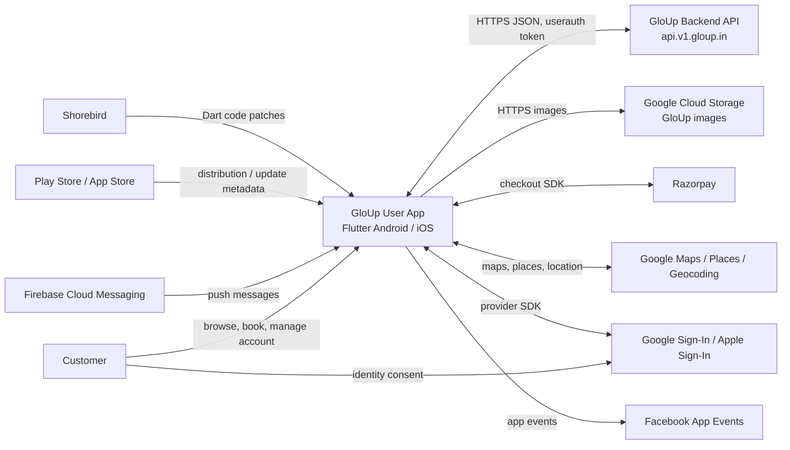

# 02. C4 Level 1: System Context

> Owner: Mobile Engineering · Last reviewed: 2026-09-28 · Applies to version: Android `2.8.14+73`

## System relationships

The customer uses the mobile app to browse salon listings, select services and a slot, complete checkout, and manage appointments. The app communicates with the backend over HTTPS using JSON and may attach the `userauth` header. Image paths resolve against Google Cloud Storage. FCM delivers remote notifications which are presented by the platform or the local notifications plugin.

Razorpay handles the payment UI; order creation and payment verification are performed through the GloUp API. Location functionality combines device location, Google Maps widgets, Places/Geocoding packages, and app permissions. Google and Apple sign-in are available through provider SDKs. Facebook App Events, store update checks, and Shorebird are declared integrations; exact production configuration and operational ownership should be confirmed in platform/release runbooks.

App Links hosts are declared in native configuration, but current Dart link handling logs URIs and does not route them to screens. See [navigation](06-navigation-and-deep-links.md).
