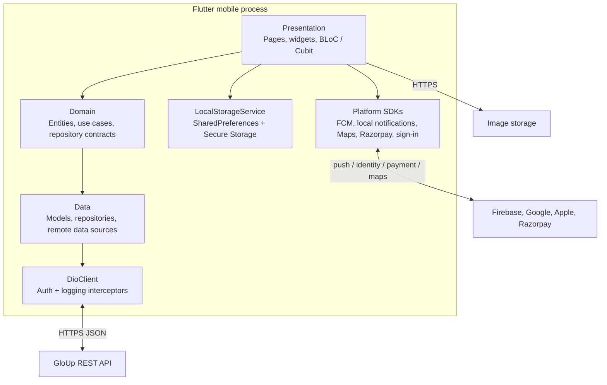

# 03. C4 Level 2: Containers

> Owner: Mobile Engineering · Last reviewed: 2026-09-28 · Applies to version: Android `2.8.14+73`

The app is one deployed Flutter client, not a set of independently deployed services. Feature folders generally contain presentation, domain, and data code. `core/` supplies cross-cutting infrastructure and `shared/` contains reusable salon-domain access and widgets.

Network calls use `DioClient` with 60-second send and receive timeouts, authentication and logging interceptors, and JSON response configuration. Sensitive access tokens are stored using `FlutterSecureStorage`; preferences such as onboarding state, location, theme, and dismissed review IDs use `SharedPreferences`. Platform integrations are accessed through Flutter plugins and native project configuration.

There is no local database or general offline data store evident in the current implementation. Image caching is handled through `cached_network_image` and app wrappers; see [storage](10-local-storage-and-caching.md).
