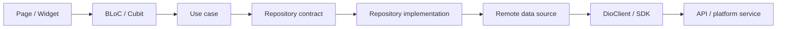

# 04. App Architecture

> Owner: Mobile Engineering · Last reviewed: 2026-09-28 · Applies to version: Android `2.8.14+73`

## Layers and flow

Feature code follows Clean Architecture where implemented: `presentation` (pages, widgets, BLoC/Cubit) → domain (entities, repository interfaces, use cases) → data (repository implementations, models, data sources) → network or platform API. Data models translate backend-shaped data into domain entities. Some features are thinner and may call shared use cases; keep dependencies directed inward and avoid UI importing data implementations.

## State management and DI

Feature workflows primarily use `flutter_bloc`; selected app-wide observable values use Provider (`LocationProvider`, `ThemeProvider`). `get_it` registrations are centralized in `core/di/injection_container.dart`. Use lazy singletons for stateless shared services, repositories, use cases, and deliberately shared state (for example home, category, favorites, appointments); use factories for screen-scoped BLoCs where a fresh lifecycle is expected. Check the existing registration and provider lifecycle before adding a dependency.

`main.dart` initializes bindings and storage, Firebase, local notifications, DI, heartbeat, and push handling before `runApp`. Global BLoCs and Providers are wired at the root. Initialization order matters: notification service uses the registered `DioClient`.

## Errors

`DioClient` maps transport and HTTP errors to `ApiException` subclasses. Repositories generally expose `Either<Failure, T>` using `dartz`, and presentation state translates failures into UI states and messages. Preserve typed failures through each layer; do not silently turn transaction failures into success or empty data.

## Boundaries

- `core/`: app-wide networking, routing, DI, constants, providers, services, theme, and utilities.
- `shared/`: cross-feature salon contracts/use cases and reusable domain-oriented widgets.
- `features/<feature>/`: user-facing capability and its presentation/domain/data implementation.
- `features/widgets/`: reusable visual primitives that are not domain-specific.

## Adding a feature

1. Add a focused `features/<name>/` structure using presentation, domain, and data layers as needed.
2. Define domain entities and repository contracts before data implementations.
3. Register dependencies in `injection_container.dart` and expose state at the narrowest appropriate lifecycle.
4. Add route names and route construction in `core/router/`; document route parameters and auth requirements.
5. Add API paths to `ApiRoutes` and map failures explicitly if the feature calls the backend.
6. Add focused tests for domain logic, state transitions, repository mapping, and the critical user flow.
7. Update the feature catalog, relevant flow/integration pages, and ADRs for material design choices.
