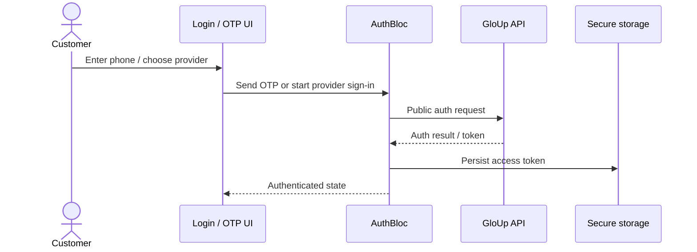
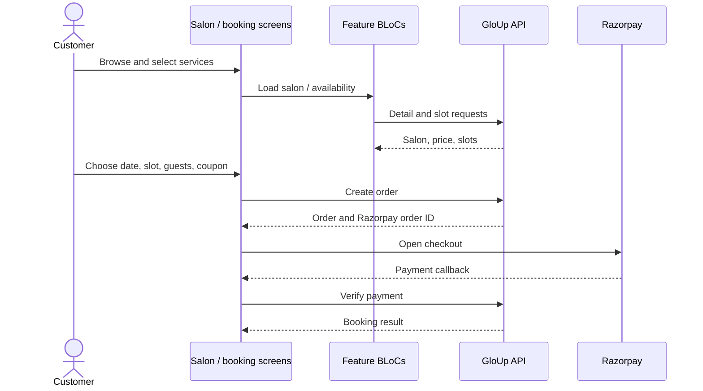

# 08. Data Flows

> Owner: Mobile Engineering · Last reviewed: 2026-09-28 · Applies to version: Android `2.8.14+73`

## Sign-in and session restore

Startup initializes local storage, migrates any legacy token, warms the secure token cache, initializes Firebase and dependencies, then builds the app. Session validity is ultimately determined by the API; protected 401 responses clear local tokens and return the user to login.

## Discovery to booking

Errors in availability should allow refresh/reselection. If payment fails or is dismissed, the app exposes failure handling and can cancel a pending order; do not retry order creation blindly. Payment success UI should follow server verification, not only a gateway client callback. Exact idempotency guarantees belong in the backend contract.

## Price rules

`BookingPriceCalculator` normalizes loosely typed service maps. Payable price is selected from `price`, `amount`, discounted amount aliases, then `sellingPrice`, with original price as a last fallback. List price checks `originalPrice`, `mrp`, then `amount`. A displayed strike-through is valid only when list price exceeds payable price. The calculation sums service list/payable totals, clamps coupon discount to subtotal, computes GST (default 5%) on the discounted taxable amount, adds the supplied platform fee, subtracts wallet amount, and clamps final payable to zero. Product/backend must confirm the fee and tax policy; avoid independently changing client and server math.

## Cancellation, reviews, notifications

Cancellation requests are server operations; any refund state is ultimately backend/payment-provider controlled. Pending-review prompts are fetched from the API and dismissal is stored by appointment ID locally. FCM messages are translated to routes by `NotificationRoutes`; see [notifications](11-notifications.md). Exact API payload schemas are maintained with backend documentation, not duplicated here.
